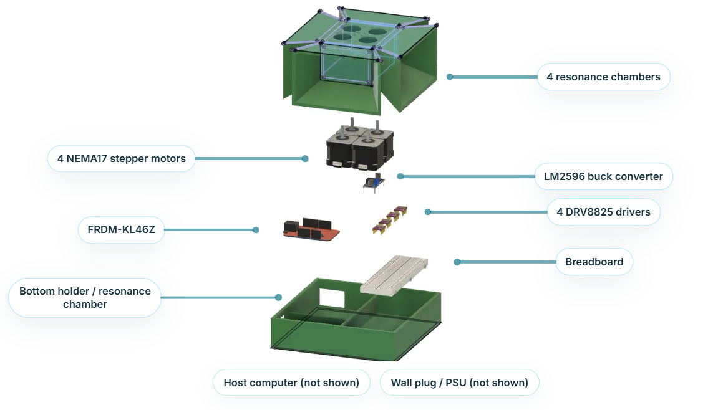

# Spinphony



Spinphony is an ECE 3140 final project that turns computer audio into live motor music. A Python host pipeline captures system audio, detects notes with an STFT, and streams motor frequency frames to an FRDM-KL46Z microcontroller. The board drives four NEMA17 stepper motors through DRV8825 drivers, making the motors act like a rough electromechanical speaker.

Built by Ibrahim Ahmed, Geneustace Wicaksono, and Ibrahim Alyamani.

## Demo

- Project website: <https://sentientplatypus.github.io/spinphony/>
- Main demo video: <https://www.youtube.com/watch?v=9HgGE3Rc5pE>
- Full demo/sample playlist: <https://www.youtube.com/playlist?list=PL1kjgJJbafhrtG4_A-ouzDBUkkYVFYieY>

The playlist includes the final demonstration plus sample songs such as Demon Slayer OP 1, Naruto - Silhouette, One Piece - "We Are", Pirates of the Caribbean, Gravity Falls, Super Mario, Star Wars, Bad Apple, and more.

## What It Does

Spinphony listens to audio routed through a virtual audio cable instead of using an analog microphone. The host computer captures 48 kHz audio, mixes it to mono, normalizes it, resamples it to 8.4 kHz, and runs a Hann-windowed STFT. The note detector scores pitch candidates, filters harmonics and very short notes, chooses up to four active pitches, and maps those pitches to stepper motor frequencies.

The FRDM-KL46Z receives compact serial packets over USB-UART at `230400` baud. Each packet carries a frame duration plus four 32-bit phase increments. The firmware buffers those frames and uses a 20 kHz timer interrupt with a 32-bit phase accumulator per motor to generate STEP pulses on GPIO pins.

## System Architecture

```text
Music player
    -> virtual audio cable / loopback recording
    -> Python audio capture at 48 kHz
    -> mono mix, normalization, resampling to 8.4 kHz
    -> STFT note detection and four-track motor assignment
    -> 20-byte serial packets at 230400 baud
    -> FRDM-KL46Z UART/DMA receiver
    -> 20 kHz motor control ISR
    -> DRV8825 drivers
    -> 4x NEMA17 stepper motors in resonance chambers
```

Key system constants:

| Parameter | Value |
| --- | --- |
| Microcontroller | FRDM-KL46Z / ARM Cortex-M0+ |
| Motors | 4x NEMA17 stepper motors |
| Motor drivers | 4x DRV8825 |
| Host capture rate | 48 kHz |
| STFT analysis rate | 8.4 kHz |
| Serial baud rate | 230,400 |
| Serial packet size | 20 bytes |
| Motor control rate | 20 kHz |
| Motor frame buffer | 128 frames |
| Playback pre-roll | 32 frames |

## Hardware

The embedded system uses:

- `FRDM-KL46Z` development board
- `DRV8825` stepper motor drivers, one per motor
- Four `NEMA17` stepper motors
- `LM2596` buck converter
- 24 V motor power supply
- Breadboarded driver/control wiring
- 3D-printed motor holder and resonance chamber assembly

Power is distributed from the 24 V supply. The DRV8825 boards use 24 V motor power, while the LM2596 steps 24 V down to 5 V for the FRDM VIN rail. The FRDM provides 3.3 V logic to the driver inputs. Grounds are common across the supply, drivers, and microcontroller. Each DRV8825 has a 100 uF capacitor across VMOT and GND, direction is fixed, and sound is produced by changing STEP frequency.

## Host Software

The host-side Python code lives in `stft/`.

| File | Purpose |
| --- | --- |
| `stft/main.py` | Captures system audio, runs the pipeline, updates the UI, and sends motor frames. |
| `stft/audio_input.py` | Selects the loopback device and provides mono/resampling/normalization helpers. |
| `stft/stft.py` | Detects note candidates and maps them to four motor frequency tracks. |
| `stft/live_ui.py` | Shows the live spectrum, detected notes, motor tracks, and stream status. |
| `stft/motor_serial.py` | Builds 20-byte packets and writes them to the FRDM serial port. |

Run it with:

```sh
cd stft
pip install numpy soundcard pyserial
python main.py
```

Before running, install and configure a virtual audio cable such as VB-CABLE, then route your browser or music player output into that device. If needed, update `DEFAULT_SERIAL_PORT` in `stft/main.py`; the current default is `COM5`.

## Embedded Firmware

The FRDM firmware lives in `MKL46Z4_Project_FINALPROJECT/`.

| File | Purpose |
| --- | --- |
| `source/main.c` | Starts the embedded application. |
| `source/app.c` | Initializes board setup, motor control, serial input, and the main service loop. |
| `source/motor.c` | Runs the 20 kHz phase-accumulator motor control loop. |
| `source/serial_stream.c` | Receives UART0 data using DMA and parses motor stream packets. |
| `source/constants.h` | Defines shared timing, serial, motor, and buffering constants. |

Build and flash the project with the NXP/MCUXpresso FRDM-KL46Z toolchain. After flashing, connect the board over USB serial at `230400` baud. The Python host will automatically send silence frames on shutdown so the motors stop cleanly.

## Packet Format

The host sends one 20-byte frame at a time:

| Bytes | Field |
| --- | --- |
| 0 | Sync byte, `0xA5` |
| 1-2 | Duration in 20 kHz motor ticks, little-endian |
| 3-6 | Motor 0 phase increment, little-endian `uint32` |
| 7-10 | Motor 1 phase increment, little-endian `uint32` |
| 11-14 | Motor 2 phase increment, little-endian `uint32` |
| 15-18 | Motor 3 phase increment, little-endian `uint32` |
| 19 | XOR checksum over bytes 0-18 |

Frequency is converted to a motor phase increment on the host:

```python
MOTOR_CONTROL_RATE = 20000
PHASE_SCALE = 1 << 32

phase_increment = round(freq_hz * PHASE_SCALE / MOTOR_CONTROL_RATE)
```

## Validation

Hardware validation covered the USB-UART link, common ground, soldered connections, the 24 V to 5 V buck output, and independent DRV8825/motor pitch tests. Software validation covered loopback audio capture, 48 kHz to 8.4 kHz resampling, STFT detection against known tones, serial packet framing/checksum behavior, and phase increment accuracy.

The website in `index.html` contains the full written report, embedded YouTube demos, sample playlist, system diagrams, code excerpts, references, and AI usage statement.

## References

- FRDM-KL46Z reference manual: <https://www.zlgmcu.com/data/upload/file/Utilitymcu/KL46-reference.pdf>
- DRV8825 datasheet: <https://www.ti.com/lit/ds/symlink/drv8825.pdf>
- NEMA17 stepper motor reference: <https://media.pbclinear.com/pdfs/pbc-linear-data-sheets/data-sheet-stepper-motor-support.pdf>
- Python SoundCard documentation: <https://soundcard.readthedocs.io/>
- NumPy FFT documentation: <https://numpy.org/doc/stable/reference/routines.fft.html>
- LM2596 datasheet: <https://www.ti.com/lit/ds/symlink/lm2596.pdf>

## Team

Ibrahim Ahmed worked on the DSP/audio pipeline, loopback audio capture and normalization, DRV8825 setup, and STFT note detection.

Geneustace Wicaksono worked on the firmware, UART/DMA serial frame receiver, 20 kHz motor control loop, and CAD design for the motor assembly.

Ibrahim Alyamani worked on system integration, hardware assembly, 3D printing, testing, website development, and documentation.

## AI Usage

Generative AI was used to help validate the system, check specific design choices, style the project website, and review documentation.
