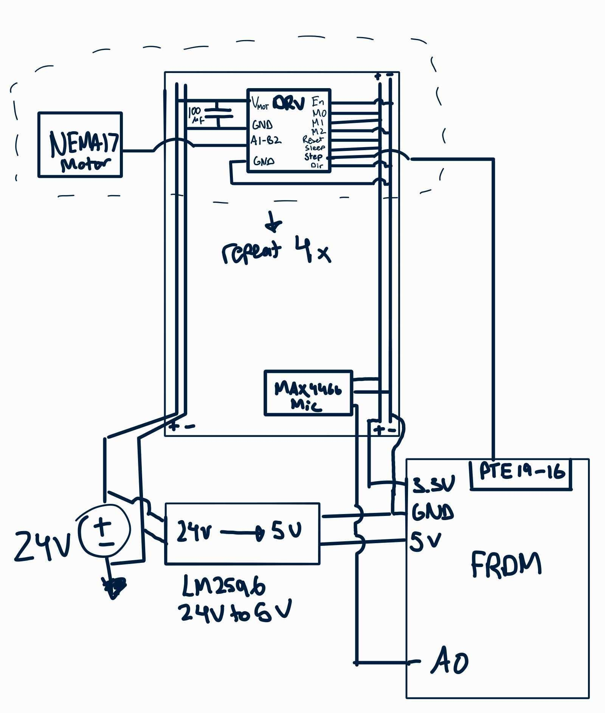

# Spinphony

## Introduction 
The project records audio from a microphone, analyzes it to extract musical notes from the polyphonic input, and then plays back the song by spinning multiple stepper motors simultaneously. The basic user interaction is that a button is held with an LED indicator, and a microphone records a short musical passage. The audio is processed, and then the system replays the extracted notes on around six stepper motors by varying their frequencies. We may also have a display to visualize a spectrogram during processing / playback. Our baseline goal is to support one instrument, likely piano, with decent polyphony. If needed, we can reduce simultaneous notes. If time allows, we will try more complex songs or multiple instruments, and have better visualizations. So far, we've soldered the microphone and headers onto the board, confirmed the microphone works and set up a PIT to sample audio into buffers on the firmware side. We are also developing the Fourier analysis in Python to test extracting frequencies from audio to have an algorithm to implement on the board. Once we get motors, we will demonstrate playing set frequencies and then generated frequencies.

## System Overview 
The system includes:

### Audio Input
- MAX4466 microphone captures analog audio  
- FRDM-KL46Z samples audio via ADC (A0)

### Signal Processing
- Audio samples are stored in buffers  
- STFT is extracts dominant frequencies  
- Frequencies are mapped to motor outputs  

### Actuation
- FRDM outputs STEP signals through GPIO pins  
- DRV8825 drivers move the motors, playing the frequency

### Hardware

- 24V power supply → DRV8825 motor drivers  
- 24V → LM2596 → 5V → FRDM VIN  
- FRDM provides 3.3V for logic and microphone  
- shared gnd  
- Video: After the overview is a good place to embed the video. The video is not required by the check-in date. 

## System Description 
### Hardware  
The schematic is shown above.
The system uses:
- FRDM-KL46Z microcontroller  
- MAX4466 electret microphone module  
- DRV8825 stepper motor drivers (×4 currently)  
- NEMA17 stepper motors  
- LM2596 buck converter (24V → 5V)  
- 24V power supply  

#### Design Decisions

**Common Ground**
- Common ground to make sure proper logic outputs

**Separate Voltages**
- 24V → motor power  
- 5V → FRDM VIN  
- 3.3V → driver logic and microphone  

**DRV8825 Configuration**
- EN is LOW (always enabled)  
- DIR is fixed
- Microstepping configured statically, currently to 1/8 resolution

**Decoupling**
- Each driver has a 100 µF capacitor across VMOT and GND  

---

### Software  

#### Sampling
- A PIT is used to sample audio at a fixed rate  
- Samples are stored in buffers  

#### Processing
- STFT is currently implemented in Python for prototyping  
- Will convert the frequency detection to assembly or embedded C  

#### Output
- Each motor is driven by a GPIO square wave  
- Pulse frequency determines motor speed and tone  

## Testing 

### Hardware Testing
Completed:
- Verified microphone produces valid analog output  
- Verified ADC readings vary with input  

Next:
- Verify LM2596 outputs stable 5V  
- Test individual motors with fixed frequencies  

---

### Software Testing
Completed:
- Verified PIT-based sampling  
- Verified buffer integrity  
- Tested frequency detection in python using known tones  

Next:
- Compare detected vs actual frequencies  
- frequency-to-motor mapping  

## Resources
- DRV8825 datasheet
- MAX4466 datasheet  
- FRDM-KL46Z reference manual  
- STFT tutorials  
- Stepper motor control tutorials, NEMA17 datasheet  

## Work Distribution
**Ibrahim Ahmed**
- Hardware design and wiring  
- Stepper driver setup  
- STFT Python prototyping  

**Geneustace Wicaksono**
- Firmware development (PIT, ADC)  
- Audio buffering  
- STFT embedded implementation  

**Ibrahim Alyamani**
- System design / integration (hardware)
- Testing and debugging
- Wiring & Soldering

## AI Usage
- AI was used for system validation, consulting with very specific design choices that were made and ensuring we weren't missing anything big.

